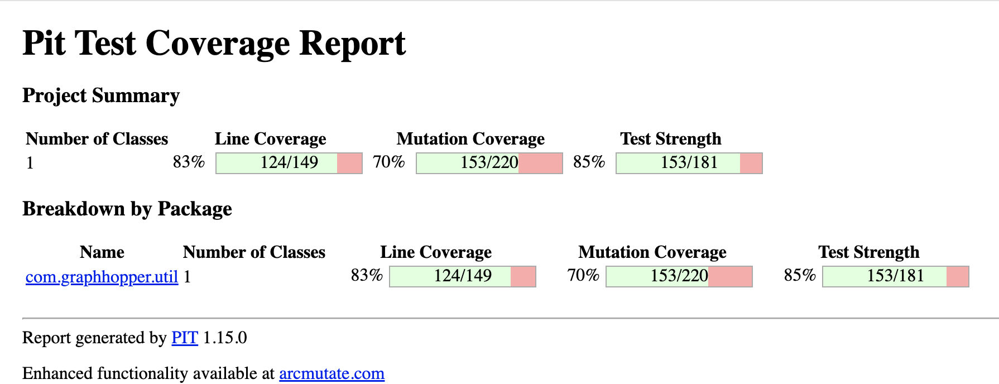
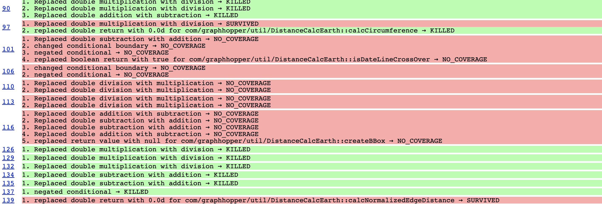
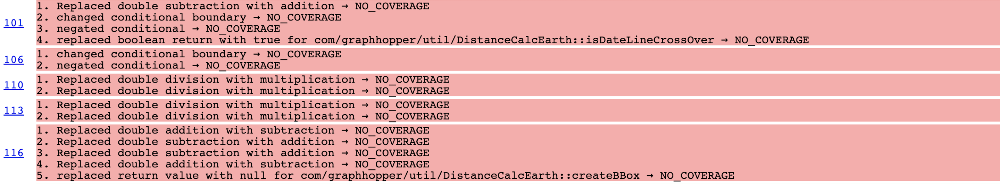
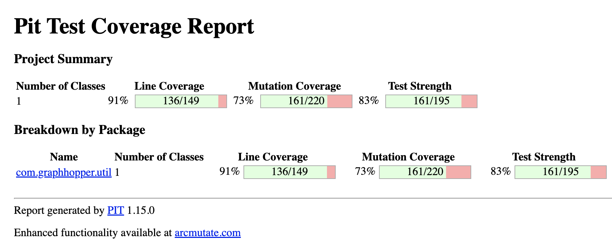

# Rapport d'Analyse et d'Amélioration des Tests pour GraphHopper - Tâche 2

**Auteurs :**
*   Hireche Tarik | 202 301 89
*   Bouzommita Ilyesse | 202 761 43

**Cours :** IFT3913
---

## 1. Introduction et Mandat

Dans le cadre de ce projet, notre mandat était d'analyser et d'améliorer la suite de tests du projet open-source GraphHopper. L'objectif n'était pas seulement d'augmenter la couverture de code, mais surtout de renforcer la capacité des tests à détecter de véritables défauts. Pour ce faire, nous avons utilisé le **test de mutation** avec l'outil **Pitest** comme principal indicateur de qualité.

Notre démarche a suivi les étapes suivantes :
1.  **Sélection rigoureuse** de classes candidates basées sur une analyse de couverture.
2.  **Développement d'une suite de tests** ciblant les cas limites et les conditions d'erreur non couverts.
3.  **Mesure quantitative** de l'amélioration via l'analyse de mutation.
4.  **Démarche itérative** d'analyse des mutants survivants pour affiner nos tests.
5.  **Intégration** de `java-faker` pour la génération de données de test réalistes.

---

## 2. Sélection des Classes Cibles

Notre première action a été de générer un rapport de couverture de code complet du projet via **JaCoCo**. Ce rapport nous a permis d'évaluer objectivement la maturité des tests pour chaque composant du module `core`. Nous avons sélectionné les deux classes suivantes :

*   **[`PointList.java`](https://github.com/SmilingAustrich/graphhopper/blob/9f4ce584587c7d30770e5894b6cee20d1dc21c69/web-api/src/main/java/com/graphhopper/util/PointList.java#L40)** : Une structure de données essentielle pour la manipulation de coordonnées géographiques. Le rapport JaCoCo indiquait une couverture de branches incomplète, notamment sur les mécanismes de validation, de gestion de la capacité et les cas d'erreur.
*   **[`DistanceCalcEarth.java`](https://github.com/SmilingAustrich/graphhopper/blob/9f4ce584587c7d30770e5894b6cee20d1dc21c69/core/src/main/java/com/graphhopper/util/DistanceCalcEarth.java#L28)** : L'implémentation principale des calculs de distance géodésique. Sa logique mathématique complexe nous a semblé être un terrain fertile pour des mutants subtils, difficiles à détecter avec des tests de surface.

---

## 3. Tests Effectués

Nous avons développé une suite de **16 nouveaux tests unitaires** pour renforcer la robustesse des classes sélectionnées. Chaque test a été documenté avec sa justification et son oracle, comme illustré ci-dessous.

### Tests pour `PointList`
*   [`testAdd2DPointTo3DListThrowsException()`](https://github.com/SmilingAustrich/graphhopper/blob/9f4ce584587c7d30770e5894b6cee20d1dc21c69/core/src/test/java/com/graphhopper/util/PointListTest.java#L261): Ce test valide la robustesse de la gestion des dimensions en s'assurant qu'une `IllegalStateException` est levée lorsqu'on tente d'ajouter un point 2D à une liste créée en mode 3D.
*   [`testGetElevationOn2DListReturnsNaN()`](https://github.com/SmilingAustrich/graphhopper/blob/9f4ce584587c7d30770e5894b6cee20d1dc21c69/core/src/test/java/com/graphhopper/util/PointListTest.java#L277): Ce test vérifie le comportement contractuel de la méthode `getEle()` sur une liste 2D, qui doit retourner `Double.NaN`.
*   [`testInternalCapacityIncrease()`](https://github.com/SmilingAustrich/graphhopper/blob/9f4ce584587c7d30770e5894b6cee20d1dc21c69/core/src/test/java/com/graphhopper/util/PointListTest.java#L294): Ce test de type "boîte blanche" valide la logique de redimensionnement dynamique des tableaux internes de la classe `PointList`.
*   [`testModificationAfterMakeImmutable()`](https://github.com/SmilingAustrich/graphhopper/blob/9f4ce584587c7d30770e5894b6cee20d1dc21c69/core/src/test/java/com/graphhopper/util/PointListTest.java#L313): Ce test garantit que le mécanisme d'immutabilité est respecté. Il vérifie qu'après un appel à `makeImmutable()`, toute tentative de modification lève une `IllegalStateException`.
*   [`testEqualsWithDifferentDimension()`](https://github.com/SmilingAustrich/graphhopper/blob/9f4ce584587c7d30770e5894b6cee20d1dc21c69/core/src/test/java/com/graphhopper/util/PointListTest.java#L329): S'assurer que la méthode `equals()` prend en compte la dimensionnalité (2D vs 3D) en plus des coordonnées lors de la comparaison.
*   [`testTrimToSizeWithLargerSize()`](https://github.com/SmilingAustrich/graphhopper/blob/9f4ce584587c7d30770e5894b6cee20d1dc21c69/core/src/test/java/com/graphhopper/util/PointListTest.java#L349): Ce test valide la garde de protection de la méthode `trimToSize()` en s'assurant qu'une `IllegalArgumentException` est levée si on tente de redimensionner à une taille supérieure à la taille actuelle.
*   [`testEmptySingletonImmutability()`](https://github.com/SmilingAustrich/graphhopper/blob/9f4ce584587c7d30770e5894b6cee20d1dc21c69/core/src/test/java/com/graphhopper/util/PointListTest.java#L365): Ce test vérifie que l'instance statique et partagée `PointList.EMPTY` est bien immuable et qu'elle rejette toute tentative de modification.
### Tests pour `DistanceCalcEarth`
*   [`testCreateBBoxWithZeroRadius()`](https://github.com/SmilingAustrich/graphhopper/blob/9f4ce584587c7d30770e5894b6cee20d1dc21c69/core/src/test/java/com/graphhopper/util/DistanceCalcEarthTest.java#L348) : Cible une condition d'erreur en s'assurant qu'un rayon invalide lève une `IllegalArgumentException`.
*   [`testCalcDist3DWithSameElevation()`](https://github.com/SmilingAustrich/graphhopper/blob/9f4ce584587c7d30770e5894b6cee20d1dc21c69/core/src/test/java/com/graphhopper/util/DistanceCalcEarthTest.java#L365) : Assure que la distance 3D est égale à la 2D si l'altitude ne change pas.
*   [`testCalcDist3DWithOneNaNElevation()`](https://github.com/SmilingAustrich/graphhopper/blob/9f4ce584587c7d30770e5894b6cee20d1dc21c69/core/src/test/java/com/graphhopper/util/DistanceCalcEarthTest.java#L386) : Vérifie la gestion correcte des données d'altitude manquantes (`NaN`).
*   [`testCrossingPointOnHorizontalEdge()`](https://github.com/SmilingAustrich/graphhopper/blob/9f4ce584587c7d30770e5894b6cee20d1dc21c69/core/src/test/java/com/graphhopper/util/DistanceCalcEarthTest.java#L406) : Teste le cas limite d'une arête parfaitement horizontale.
*   [`testCrossingPointOnVerticalEdge()`](https://github.com/SmilingAustrich/graphhopper/blob/9f4ce584587c7d30770e5894b6cee20d1dc21c69/core/src/test/java/com/graphhopper/util/DistanceCalcEarthTest.java#L422) : Teste le cas limite d'une arête parfaitement verticale.
*   [`testIsCrossBoundaryReturnsTrue()`](https://github.com/SmilingAustrich/graphhopper/blob/9f4ce584587c7d30770e5894b6cee20d1dc21c69/core/src/test/java/com/graphhopper/util/DistanceCalcEarthTest.java#L439) : Vérifie la détection du passage de l'antiméridien.
*   [`testIsCrossBoundaryReturnsFalse()`](https://github.com/SmilingAustrich/graphhopper/blob/9f4ce584587c7d30770e5894b6cee20d1dc21c69/core/src/test/java/com/graphhopper/util/DistanceCalcEarthTest.java#L454) : S'assure de l'absence de faux positifs pour la détection du passage de l'antiméridien.  
---

## 4. Analyse de Mutation avec Pitest

### 4.1. Ligne de Base : Mesure Initiale

Pour quantifier notre apport, nous avons d'abord mesuré la performance de la suite de tests existante. Pour cela, nous avons exécuté Pitest avec nos 16 nouveaux tests désactivés.

> **Résultats de la ligne de base :**
> *   Couverture de Ligne : 83%
> *   Couverture de Mutation : **70%** (153 mutants tués / 220 générés)
      Un score de mutation de 70% est ok, mais il indique que **67 mutants ont survécu**, révélant des faiblesses significatives dans la suite de tests.

#### Analyse des Mutants Survivants et Non Couverts

En analysant le rapport détaillé, nous avons identifié deux catégories principales de problèmes :

**1. Mutants Survivants dans le Code Couvert (Lignes Vertes avec Mutants Rouges)**

Certaines parties du code étaient bien exécutées par les tests (haute couverture de ligne), mais les assertions n'étaient pas assez précises pour détecter des modifications subtiles. C'est le cas du mutant que nous avons identifié sur la **ligne 97** :

*   **Ligne 97 (`calcCircumference`) :** Un mutant a survécu car il remplaçait une multiplication par une division (`*` -> `/`). Le test existant utilisait une latitude de 0, où `cos(0)=1`, rendant la mutation invisible. C'est un exemple parfait de "code couvert mais mal testé".

**2. Mutants dans le Code Non Couvert (Lignes Rouges - NO_COVERAGE)**

Plusieurs méthodes ou blocs de code n'étaient tout simplement jamais exécutés par la suite de tests originale. Par conséquent, **tous les mutants** générés dans ces zones étaient classés `NO_COVERAGE`, ce qui signifie qu'ils survivaient par défaut.

* **Lignes 101-117 (`isDateLineCrossOver`, `createBBox`) :** Comme le montre la capture d'écran, ces méthodes entières n'étaient pas couvertes. La condition `if (radiusInMeter <= 0)` sur la **ligne 106** est un cas d'erreur critique qui n'était jamais testé, laissant la porte ouverte à des bugs. De même, la méthode `isDateLineCrossOver` n'était jamais appelée.

Cette analyse initiale a été fondamentale pour orienter notre stratégie. Elle nous a confirmé que nous devions non seulement écrire des tests pour le code non couvert, mais aussi concevoir des tests plus "intelligents" pour tuer les mutants qui survivaient dans le code déjà couvert
### 4.2. Analyse Itérative et Chasse aux Mutants

Une fois nos 14 premiers tests ajoutés, nous avons constaté que le score de mutation restait inchangé à 70%. Cette observation cruciale a orienté notre travail : nos tests, bien que valides, ne ciblaient pas les failles exploitées par les 67 mutants survivants.

Nous avons donc adopté une démarche de **"chasse aux mutants"** :
1.  **Analyse des Survivants :** Nous avons étudié en détail le rapport Pitest pour identifier les mutants qui n'étaient pas détectés.
2.  **Conception de Tests "Tueurs" :** Nous avons écrit deux tests supplémentaires, chacun conçu avec le seul objectif de tuer un mutant spécifique.

### 4.3. Résultats Finaux et Quantification de l'Amélioration

Après avoir ajouté les deux tests "tueurs", nous avons relancé l'analyse complète.

Le tableau ci-dessous synthétise l'amélioration obtenue :

| Suite de tests             | Mutants Générés | Mutants Tués | Score de Mutation |
| -------------------------- | :-------------: | :----------: | :---------------: |
| Tests Originaux (Baseline) |       220       |     153      |     **70%**       |
| Tests Finaux (avec ajouts) |       220       |     161      |     **73%**       |

**Conclusion :** Notre démarche itérative et ciblée a permis d'augmenter le score de mutation de **3 points de pourcentage**, en éliminant **8 mutants** qui survivaient auparavant.

---

## 5. Analyse Détaillée des Mutants Éliminés

Voici l'analyse technique de deux mutants que notre démarche a permis d'éliminer.

### Mutant 1 : `calcCircumference` (Opérateur Mathématique)

*   **Le Mutant :** Sur la ligne 97 de `DistanceCalcEarth.java`, un mutant de type "Math" a remplacé l'opérateur de multiplication (`*`) par un opérateur de division (`/`) dans la formule `2 * PI * R * cos(toRadians(lat))`.
*   **Analyse de Survie :** Ce mutant était indétectable par la suite de tests originale car le seul test existant (`testCalcCircumference`) utilisait une latitude de 0 degré. Or, comme `cos(0)` vaut 1, multiplier ou diviser par 1 donne le même résultat. Le mutant était donc sémantiquement équivalent *dans le contexte de ce test unique*.
*   **Notre Solution :** Nous avons ajouté le test [`testCircumferenceAtLatitude()`](https://github.com/umontreal-diro/graphhopper/commit/d870d510c462c6f950469104f841d6105997189b#diff-96592738154f3d8343d4f1c548cd05cc85f54ad0f62da50fe94a1900c04e584eR479), qui appelle la méthode avec une latitude de 45 degrés. Comme `cos(45)` est `~0.707`, la différence entre la multiplication et la division devient significative, ce qui fait échouer l'assertion et tue le mutant.

### Mutant 2 : `calcDist3D` (Opérateur Conditionnel)

*   **Le Mutant :** Sur la ligne 68, un mutant a remplacé l'addition (`+`) par une soustraction (`-`) dans la formule de Pythagore `sqrt(eleDelta² + len²)`.
*   **Analyse de Survie :** Aucun test ne validait le calcul 3D avec un cas d'école simple où les deux composantes (horizontale et verticale) étaient non nulles et permettaient une vérification facile de la formule.
*   **Notre Solution :** Notre test [`testCalcDist3DWithPythagoras()`](https://github.com/umontreal-diro/graphhopper/commit/d870d510c462c6f950469104f841d6105997189b#diff-96592738154f3d8343d4f1c548cd05cc85f54ad0f62da50fe94a1900c04e584eR496) a été conçu pour simuler un triangle rectangle 3-4-5. Nous avons créé deux points séparés de 3000m en altitude et ~4000m en distance horizontale. L'oracle attendait une hypoténuse de 5000m. Le code muté, calculant `sqrt(4000² - 3000²)`, retournait un résultat erroné, ce qui a permis de tuer le mutant.

---

## 6. Utilisation de Java-Faker pour la Génération de Données

Enfin, pour répondre à la dernière exigence, nous avons intégré la librairie `java-faker`. Nous l'avons utilisée pour implémenter le test [`testAddWithFakerGeneratedData()`](https://github.com/umontreal-diro/graphhopper/commit/d870d510c462c6f950469104f841d6105997189b#diff-b62c929c7227697be4e5237d3abbab2beacaaf6d0f1102b07e80fc3c4deee0b2R390). Ce test valide la robustesse de la méthode `add()` de `PointList` en la soumettant à une boucle de 100 ajouts de coordonnées géographiques valides mais aléatoires, un scénario qui se rapproche davantage d'une utilisation réelle.

---
